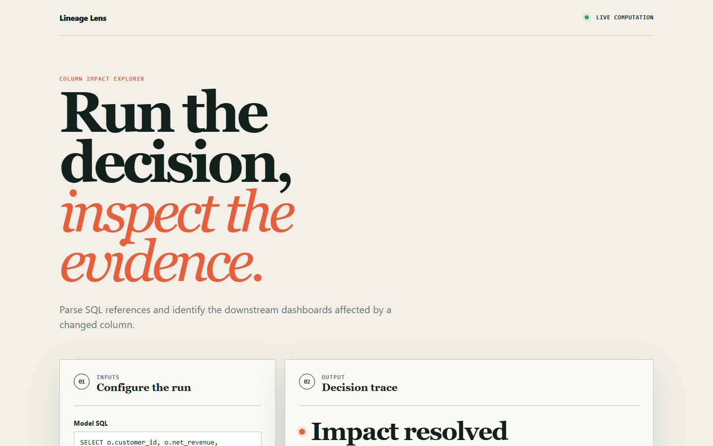
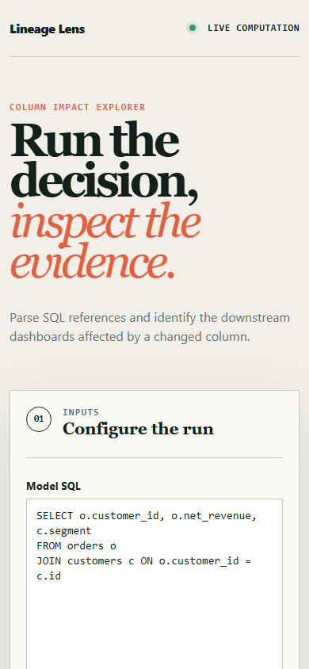

# lineagelens

> Column-level lineage that answers 'which three dashboards break', not 'forty-seven objects touch this table'.

## Live deployment

[](https://github.com/SlateGitOrg/lineagelens/actions/workflows/ci.yml)

[Open the working Lineage Lens application](https://slategitorg.github.io/lineagelens/)

This deployed application runs the project's decision workflow in the browser. Change the inputs, run the analysis, and inspect the computed metrics and decision trace.

### Desktop



### Mobile



`COMPACT` · **Business Analyst** · Intermediate · ~5 days · Retail - analytics team supporting 200 dashboards

**Primary language:** Python
**Tags:** `lineage`, `sqlglot`, `dbt`, `impact-analysis`, `developer-tooling`, `sql`

---

## The problem

An engineer renames a column in a source table. Somewhere, four dashboards break - but nobody knows which until an executive notices a blank tile on Monday morning. The analyst is then the person who has to reconstruct what depended on what, by reading SQL.

## ⭐ The differentiator

**Column-level** lineage rather than table-level, resolved through `SELECT *`, CTEs and subqueries. Table-level lineage says '47 downstream objects touch this table', which is useless; column-level says 'three objects read this specific column, here they are'. Generic lineage tools stop at table granularity precisely because star-expansion and CTE resolution are the hard part - and that hard part is the entire value.

This is the sentence to lead with when someone asks you to walk through the
project. Everything else in this repo exists to make it true and to prove it.

## Data

dbt project manifests (open-source dbt projects on GitHub provide realistic fixtures) plus a fixture SQL corpus with **hand-annotated expected column lineage**, including the awkward cases: star expansion, self-joins, unions with positional matching.

> No paid API key is required to run or demo this project. Where a paid
> service would add value it is wired as an optional enhancement behind an
> interface with an offline mock as the default implementation.

## Stack

- Python with SQLGlot (a real SQL parser, dialect-aware)
- DuckDB, NetworkX
- Typer CLI, Graphviz/Mermaid rendering
- pytest

## Core capabilities

- SQL parsing to column-level lineage across CTEs, joins, unions and star expansion
- Impact query: given a column, return the transitive downstream column and dashboard set
- Blast-radius scoring weighted by downstream dashboard usage
- Mermaid / Graphviz rendering of a single column's path
- CI mode commenting the impact set on any pull request touching a model

## Repository layout

```
src/lineage/
src/impact/
fixtures/annotated/
render/
test/
```

## Build plan

1. Write the annotated fixtures first, including the awkward cases. They are the specification.
2. Resolve star expansion early - if you defer it, the architecture will not accommodate it later.
3. Impact query and blast-radius scoring, then rendering.
4. CI comment last.

## Testing strategy

Assert **exact column-lineage recovery on around 80 annotated fixture queries**, with explicit cases for `SELECT *` expansion, self-joins, and unions where columns match by position rather than name. Partial credit is not useful here: a lineage tool that is right 90% of the time cannot be trusted for impact analysis.

Tests assert **correctness**, not merely that the code runs. A green suite on
this repo is a claim about behaviour under adversarial conditions; treat any
test that would pass against a deliberately broken implementation as a bug in
the test.

## Measurable outcome

> A rename that would have taken a day of SQL archaeology now returns three affected dashboards in two seconds - against the table-level answer of forty-seven objects.

State it in these terms — business units, not technical ones — in your CV
bullet and in the first thirty seconds of describing the project.

## Interview questions this project answers

- **How do you resolve lineage through SELECT *?**
- **What breaks column-level lineage?**
- **How would you use this in code review?**

## What this deliberately is *not*

- Not a data catalogue. It computes one thing well and hands the result to whatever you already use.


## Run it now

```bash
python -m unittest discover -s tests -v   # the suite
python -m src.demo                        # the 60-second artefact
```

Requires Python 3.11+. The runnable core uses **only the standard
library** (including `sqlite3`), so there is nothing to install.

## Getting started

```bash
git clone <your-fork-url> lineagelens
cd lineagelens
pip install -e .
lineagelens build --manifest target/manifest.json
lineagelens impact --column raw.orders.discount_pct
lineagelens render --column raw.orders.discount_pct > lineage.md
pytest
```

Docker is supported but optional — every path above works on a plain
Windows/macOS/Linux laptop without a cloud account.

## Definition of done

- [ ] The differentiator above is implemented, and a test proves it
- [ ] The measurable outcome is produced by a command anyone can run
- [ ] `README` explains the one decision a generic version gets wrong
- [ ] CI runs the full suite on every push and is green on `main`
- [ ] A recruiter can see the headline artefact in under 60 seconds

## Licence

MIT — see [LICENSE](LICENSE).
